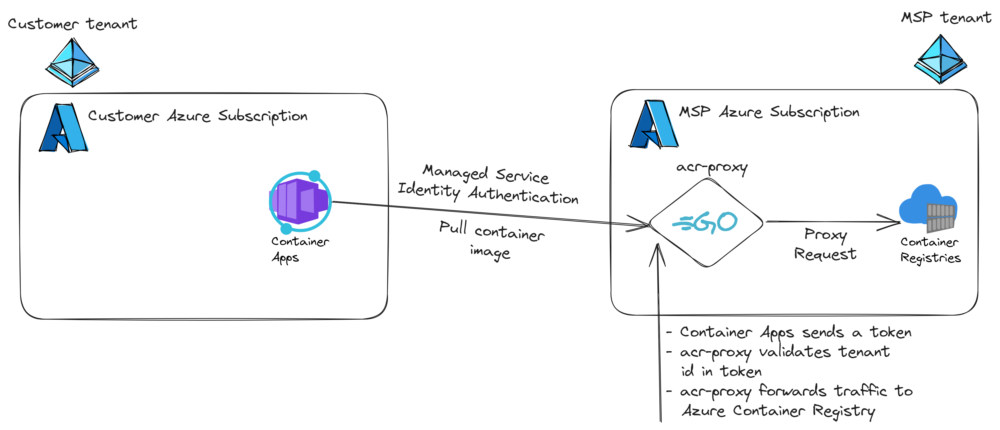

# Azure Container Registry Proxy

This project is a single purpose proxy for Azure Container Registry, to be used by Azure Container Apps in other Azure AD / Entra ID tenants. It's meant to allow Azure Container Apps from other tenants to pull container images from your Azure Container Registry, without sharing a secret (by utilizing Managed Service Identity authentication).

Please note that the admin credentials for Azure Container Registry is used, but only `GET` and `HEAD` requests are forwarded to the proxy. This is to keep the proxy code as simple as possible nand not have to take into account the oauth2 flow that would be required if we use tokens or MSI auth. With this in mind, there is no way right now to grant different tenants access to different parts of Azure Container Registry. They can list and pull all container images stored on the Azure Container Registry.

## Overview



## Running locally

Create `.tmp/env` and add the following:

```text
ALLOWED_TENANTS=[tenant uuid]
REGISTRY_NAME=[azure container registry name]
REGISTRY_USER=[acr admin username]
REGISTRY_PASSWORD=[acr admin password]
```

Run it with: `make run`

## Deploying

Before you deploy using terraform locally, you will need to create `.tmp/lab.tfvars` with the following content:

```terraform
location           = "West Europe"
location_short     = "we"
environment        = "lab"
name               = "[common name]"
unique_suffix      = "[four digits]"
allowed_tenant_ids = ["uuid"]
acr_proxy_version  = "xyz"
```

Deploy it using: `make terraform-up`

## Testing that it works

NOTE: Before running this, make sure you have configured `acr-proxy` to allow the tenant id for which environment you will deploy below. See the terraform variable `allowed_tenant_ids`.

Before you can test it, you need to create `.tmp/customerapptest.tfvars` with the following content:

```terraform
azurerm_container_app_environment_name = "me-lab-we-acrproxy"
resource_group_name                    = "rg-lab-we-acrproxy"
acr_proxy_fqdn                         = "acr-proxy.[something].[region].azurecontainerapps.io"
image                                  = "nginx:latest"
```

Then push nginx to your ACR:

```
az acr login --name [acr_name]
docker pull nginx:latest
docker tag nginx:latest [acr_name].azurecr.io/nginx:latest
docker push [acr_name].azurecr.io/nginx:latest
```

Then deploy it: `make terraform-up-customerapptest`

If it succeeds, then everything should be working. Verify that you can see the nginx logs.

Then destroy the test: `make terraform-down-customerapptest`

## License

This project is licensed under the MIT License - see the [LICENSE](LICENSE) file for details.
